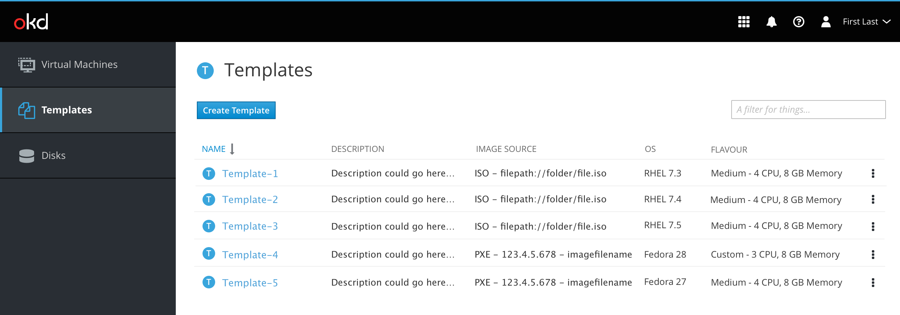
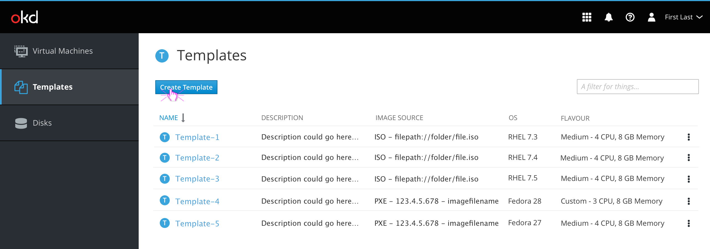
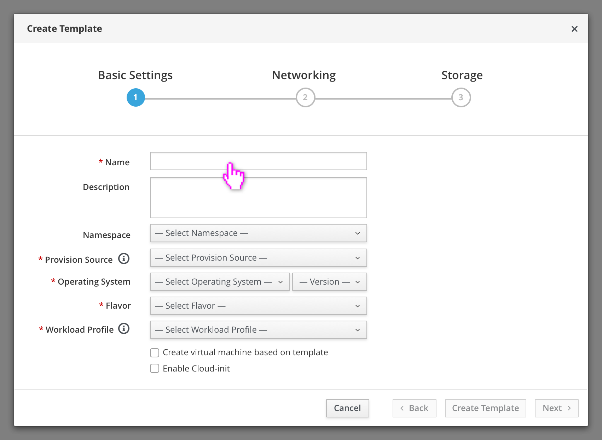
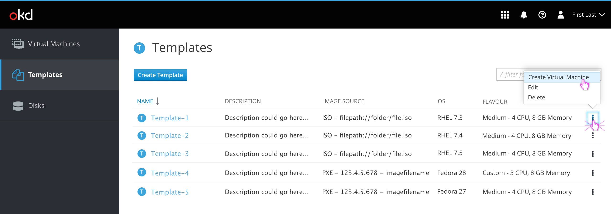
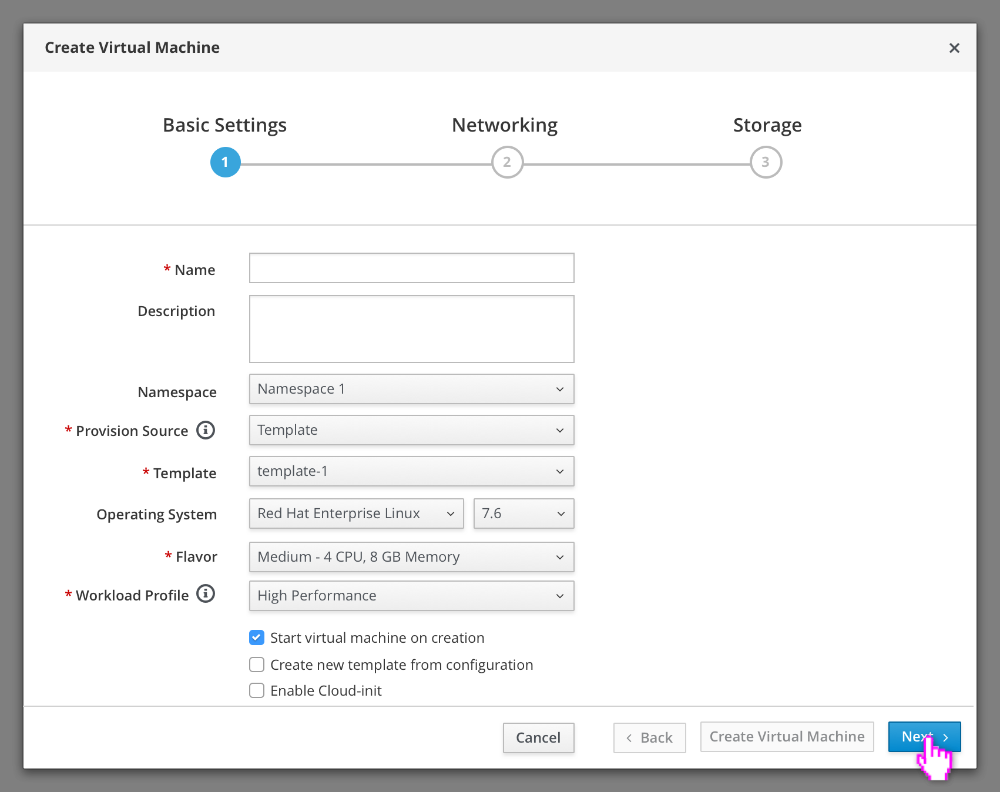
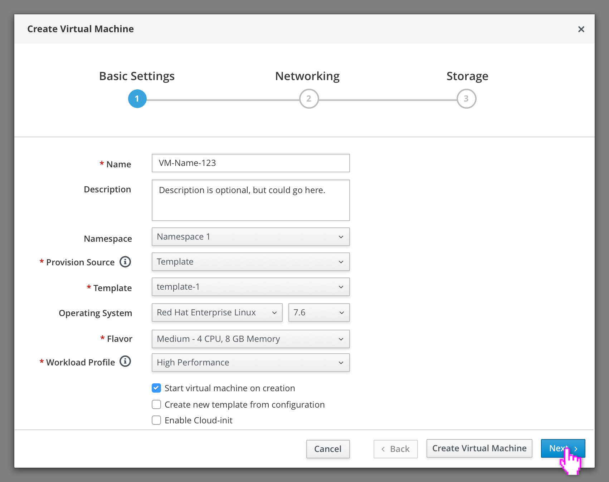
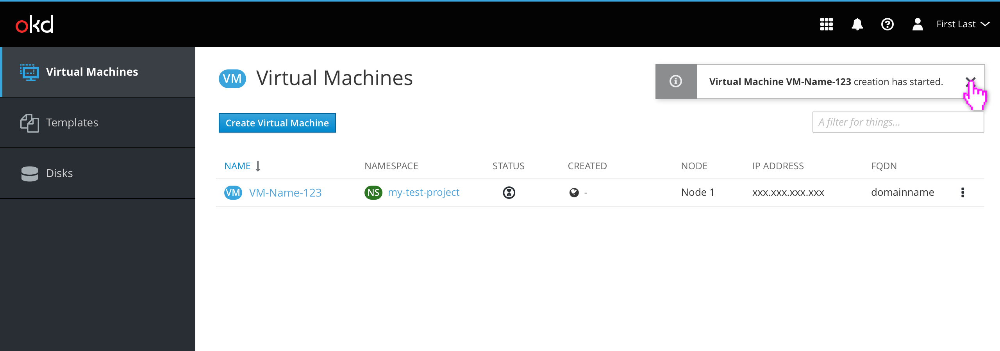

# Templates

Templates allow the user to create a predefined configuration that can be used to speed up the creation of Virtual Machines.

## Template List

From the template list a user can create a new VM from a selected template or create, edit, and delete templates.

## Create Template

Selecting Create Template will present the user with a wizard similar to the create new VM wizard, but with fewer options.

Templates require a Name, Provision Source, Operating System, Flavor, and Workload Profile. Description and Namespace are optional.

Similar to the creation of a VM, users can finish creating the template after this step, but are encouraged to proceed to configure Networking and Storage.

## Create Virtual Machine from Template

Users can quickly create a VM based on a template using the action menu.

The Create VM Wizard that appears would be pre-filled with the template's information.

The user could then make any VM-specific changes before creating the VM. After finishing the Create VM wiard the user would be taken to the Virtual Machine List View to view the new VM's creation progress.

