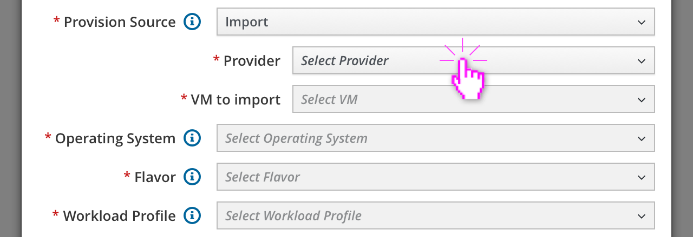
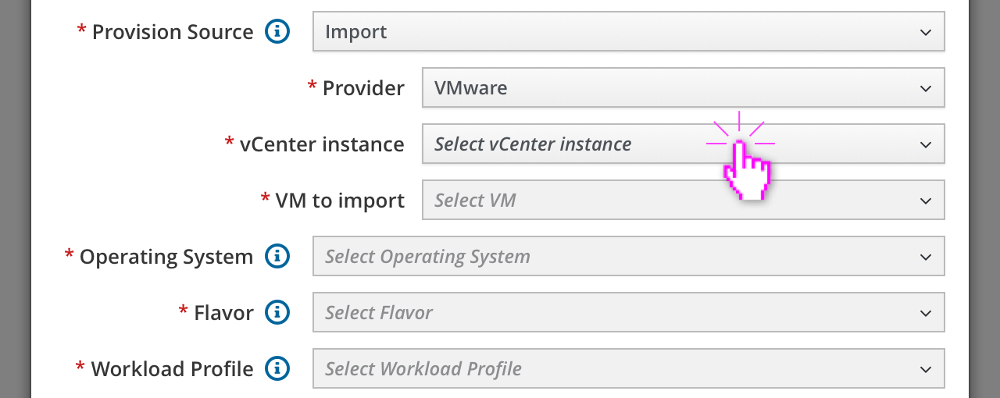
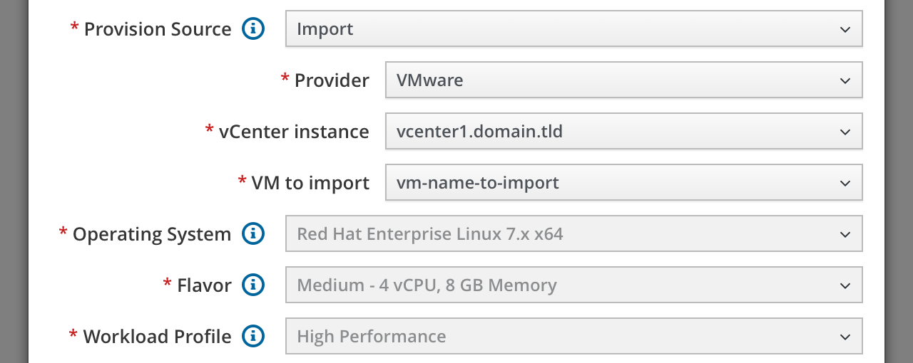
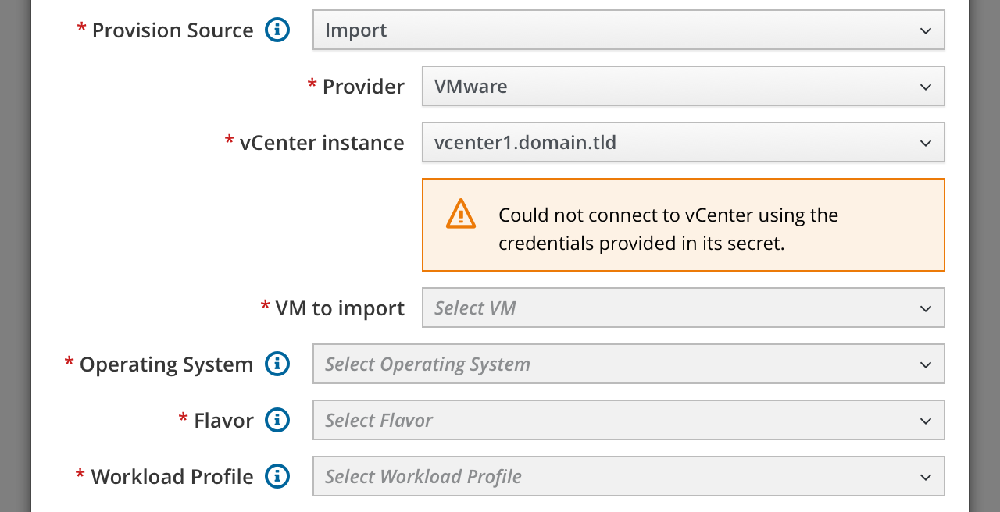
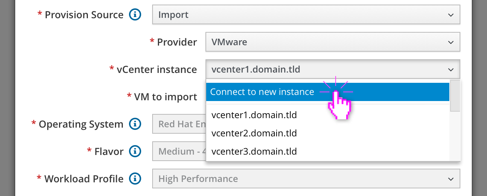
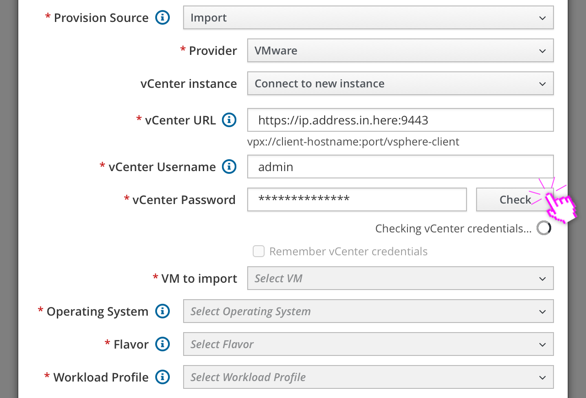
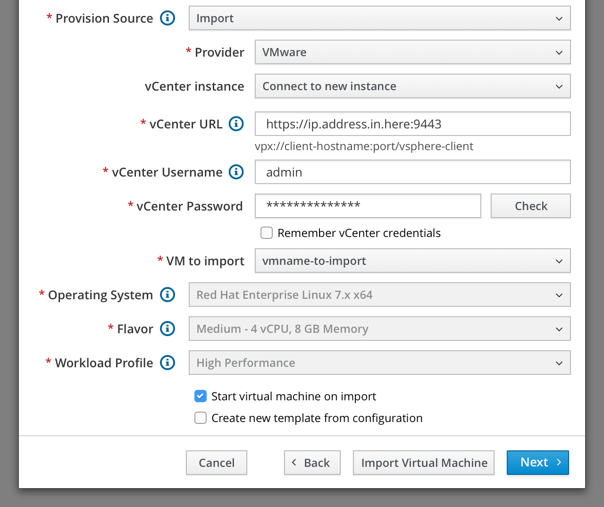
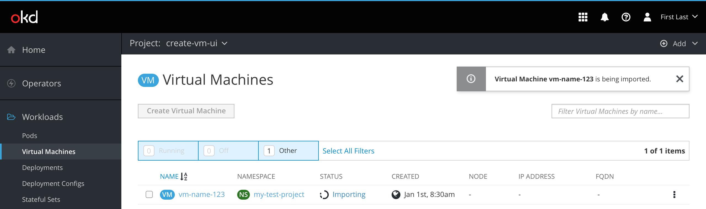

# Import VM

<mark>Note:</mark> This design has been updated and merged into the [OpenShift Design repository](https://github.com/openshift/openshift-origin-design).

Virtual machines can be imported from a curated list of supported providers.

#### VMware vCenter

The user chooses `Import` as the Provision Source and then selects `VMware` as the Provider.

If VMware is chosen, a new "vCenter instance" field appears. The user clicks it to see a list of previously-connected vCenter instances that have been stored as [Kubernetes Secrets](https://kubernetes.io/docs/concepts/configuration/secret/). The user selects one.

<mark>Note:</mark> There could be thousands of VMs in this list. Depending on technical constraints, this UI could either include a [PatternFly 3 TypeAhead Select](https://rawgit.com/patternfly/patternfly-react/gh-pages/patternfly-3/index.html?knob-Submit%20Form%20On%20Enter=true&knob-select%20Hint%20On%20Enter=true&knob-Set%20the%20Minimum%20Length%20to%20Autocomplete=1&knob-highlight%20Only%20Result=true&knob-Allow%20Adding%20New%20Items=true&knob-Multiple%20Selection=true&knob-Size=small&knob-Leeway=2&knob-Clear%20Button=true&knob-Max%20Shown=1&selectedKind=patternfly-react%2FForms%20and%20Controls%2FTypeAhead%20Select&selectedStory=Using%20Async%20Calls&full=0&addons=1&stories=1&panelRight=0&addonPanel=storybooks%2Fstorybook-addon-knobs) component, the PatternFly 4 equivalent, or a text input with a button to check if there’s a single identical match within vCenter. Options are still being explored.

When a vCenter instance is selected, the first (alphabetical) virtual machine along with its OS, Flavor, and Workload Profile are automatically selected and filled in but remain disabled.

If the wizard cannot connect to the vCenter instance using the credentials stored within its Secret, an error message will be displayed. The user will need to fix the Secret’s credentials before continuing.

The user can also connect to a new vCenter instance by clicking `Connect to new instance` from within the dropdown.

ℹ️ vCenter URL: Enter the URL address of the vCenter Server.
ℹ️ vCenter Username: Enter your vCenter username. You will only be able to import virtual machines that are available to this username.

New fields for vCenter URL, vCenter Username, vCenter Password, and VM to import appear along with a checkbox to "Remember vCenter credentials" that is unchecked by default.

The vCenter URL field should include a syntax hint with the desired formatting. The user is likely to paste a variety of URLs, so any FQDN the user submits should be validated and automatically corrected before being used to communicate with vCenter’s API.

When the user clicks the "Check" button a text string appears below the button with a spinner to indicate that the credentials are being checked.

If the wizard fails to connect to vCenter using the provided credentials, an error similar to the one above for an invalid vCenter instance should be displayed directly below the vCenter Password field.

If the connection to vCenter succeeds, the first (alphabetical) VM along with its OS, Flavor, and Workload Profile are automatically selected and filled in as usual. The "Remember vCenter credentials" checkbox also becomes enabled to allow the user to save them as a new Kubernetes Secret.

With the target virtual machine selected, the user can either quickly skip to Step 5 "Review" by clicking the "Import Virtual Machine" secondary action button, or click "Next" to proceed through the rest of the wizard.

As soon as the import process begins an informational toast notification should let the user know that the virtual machine is being imported. The virtual machine should appear within the list with a status of "Importing". Hovering the status will display a tooltip with the current progress. Clicking the status will open the virtual machine’s Events page.