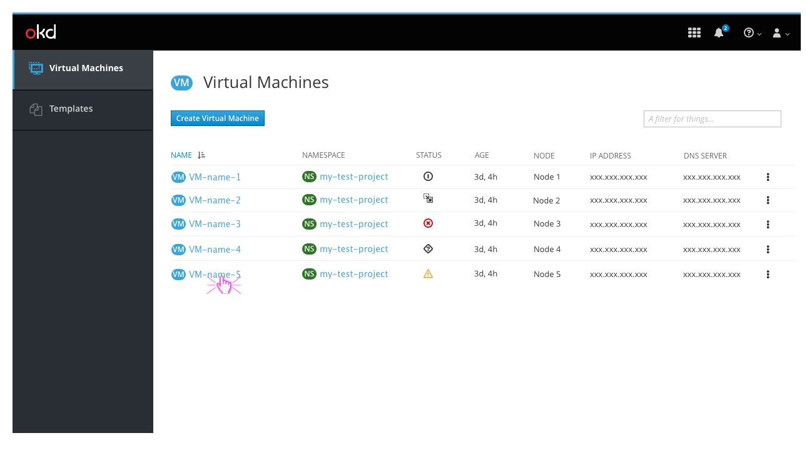
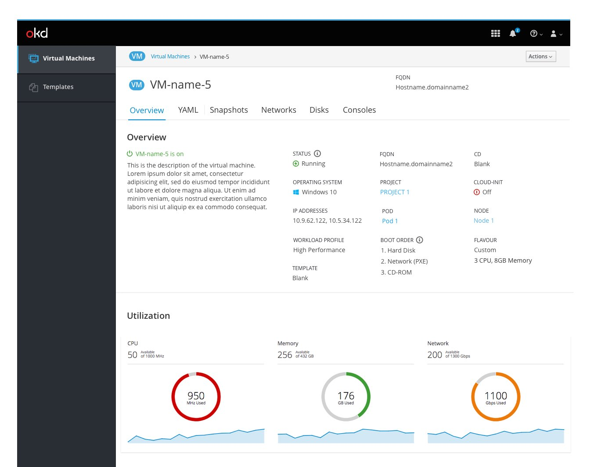
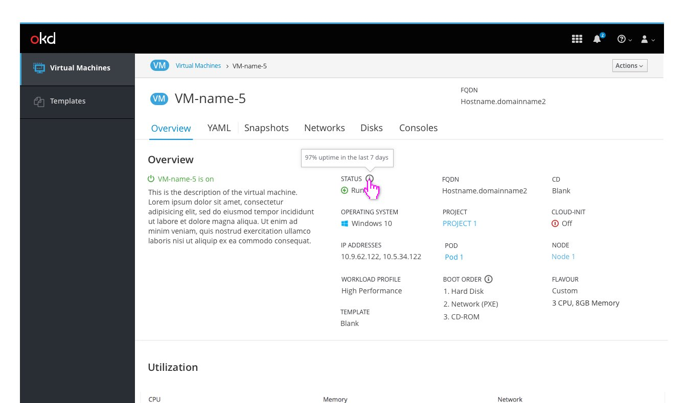
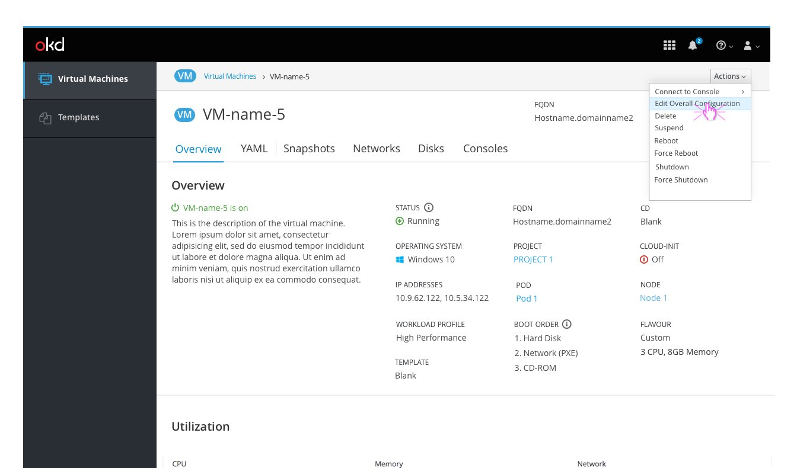
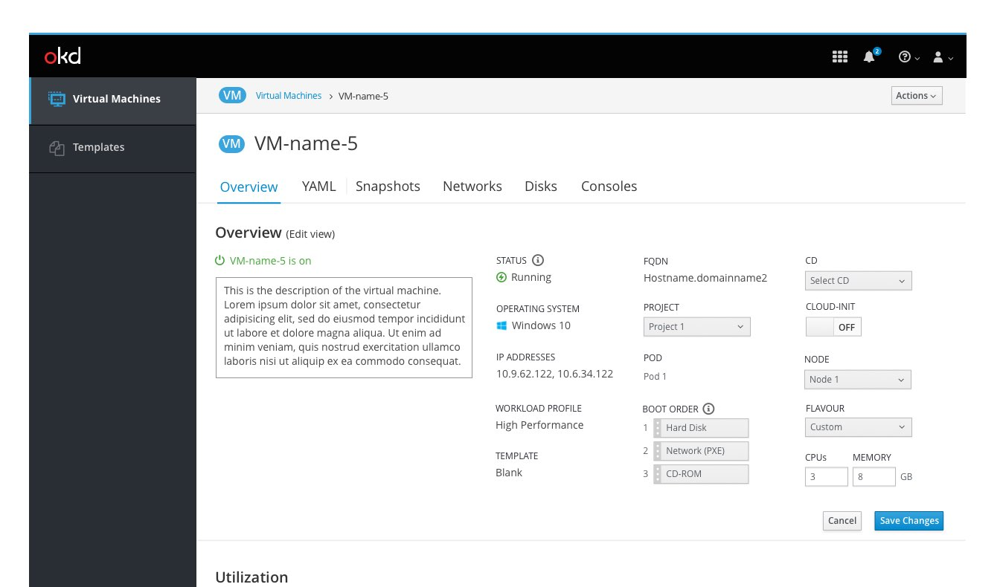
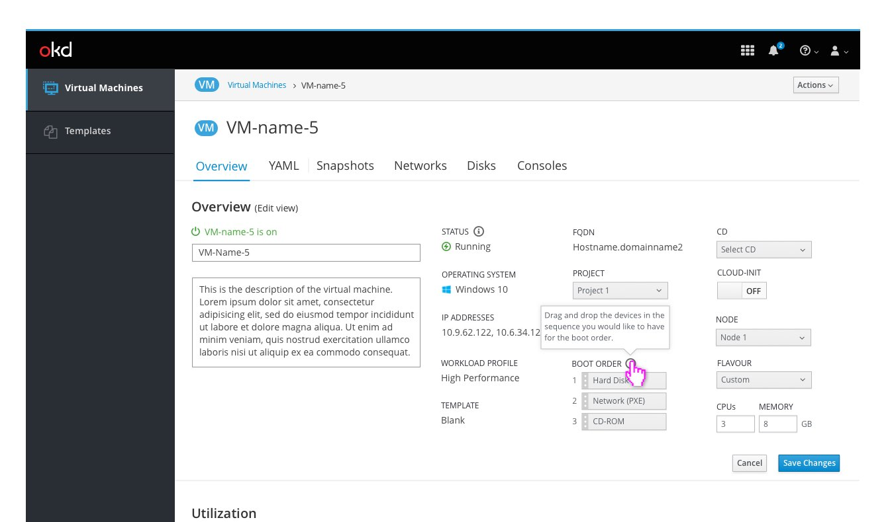
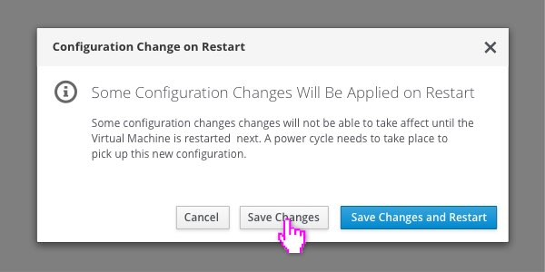
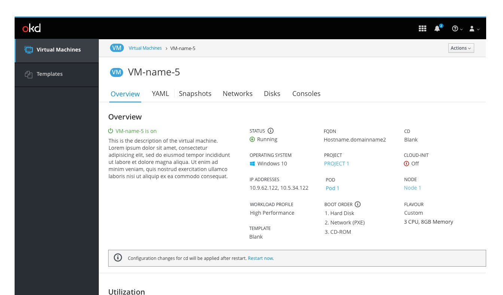

# VM Details

Clicking on the name of the Virtual Machine in the list view will take the user into the details view of that VM.

The details of the Virtual Machine are separated into tabs:
- Overview
- YAML
- Snapshots
- Networks
- Disks
- Consoles

On the overview tab both a general overview and utilization are provided.

Additional information is provided via tooltips for status and boot order.

The user can then edit the overall details of the VM from the action menu in the top right.

Once in Edit mode all available options will show as editable.

In this mode the boot order can be arrange with drag and drop. A tooltip is provided to clarify this action.

In some scenarios, the edits a user makes to a VM will not be applied to it until the VM has been restarted.

Once the details have been edited the user can save their changes or cancel. Either action would send them back to the overview page.

When changes are saved the user is notified via an inline notification.

 