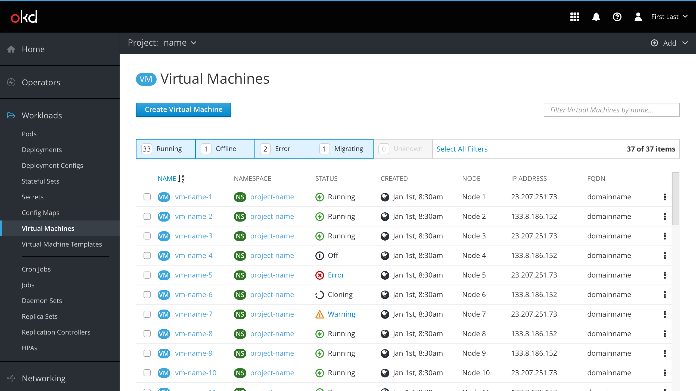
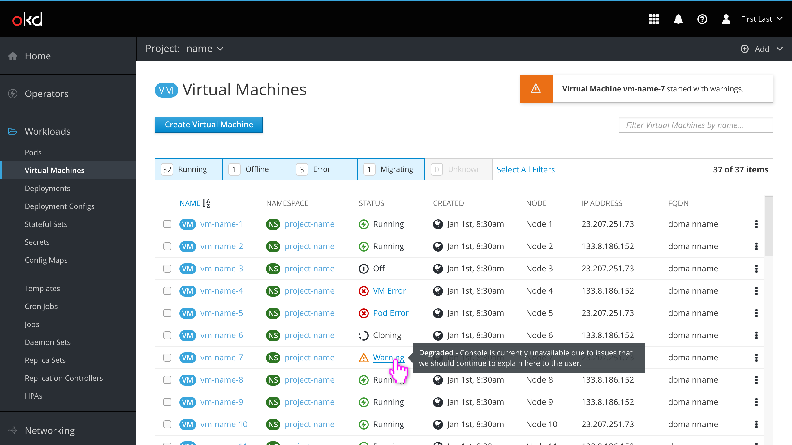
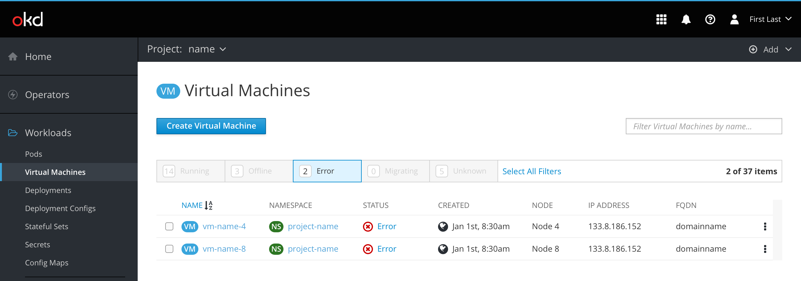
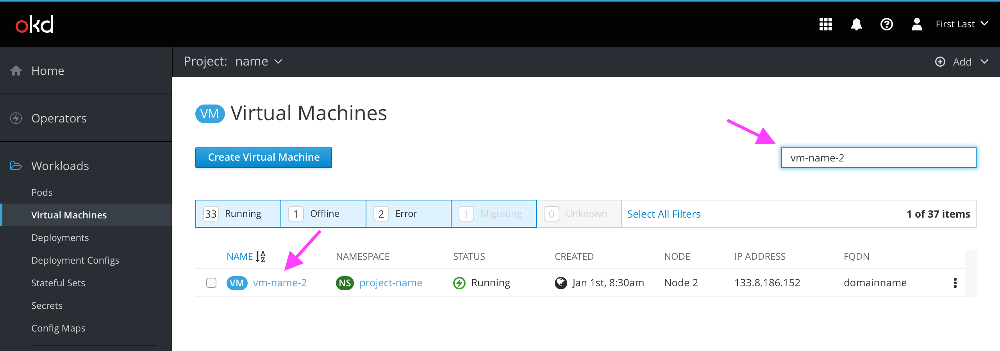
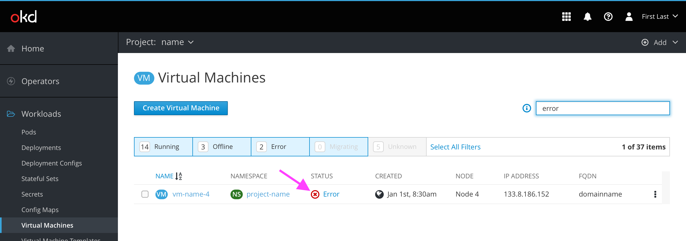
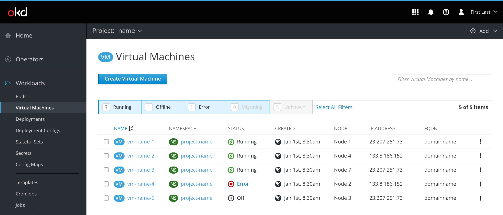
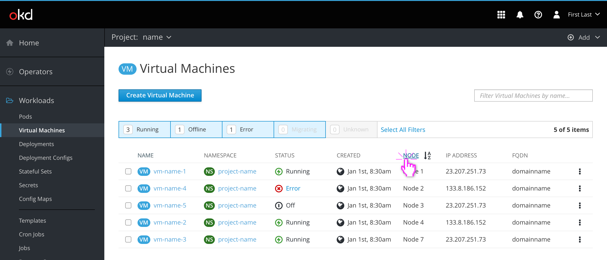
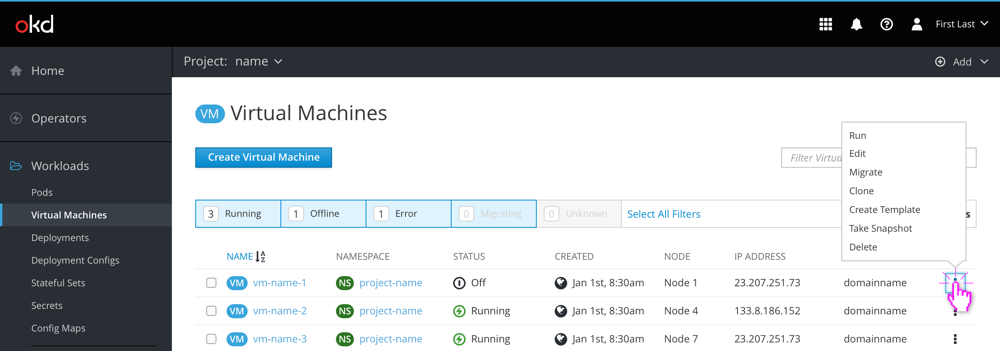
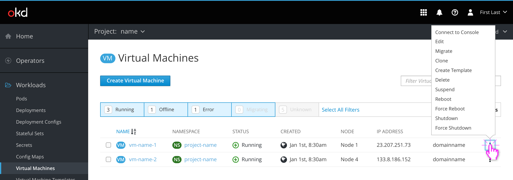

# VM List view

The VM list contains columns for the following:
- Name
- Namespace
- Status
  - Running, Off, Error, Warning, Cloning/Migrating, Unknown
- Created
  - Date formatting should follow OpenShift's console, viewable [here](https://github.com/openshift/console/blob/master/frontend/public/components/utils/timestamp.jsx) and [here](https://github.com/openshift/console/blob/master/frontend/public/components/utils/datetime.ts)
  - If possible, the `div`'s title attribute should be set to the exact date/time of creation, including year so that it appears when hovered.
- Node
- IP Address
- FQDN

## Errors and Warnings

Hovering over an error or warning in a VM's status column should display a tooltip with a brief description of the issue. If multiple errors/warnings exist, the description should be more generic. Clicking on an error or warning should bring the user to the VM's Events page for more details.

## Filtering

### Item filters

The predefined filters in the filter bar can be used to narrow the VM list by Status. The user clicks each tab to toggle it on and off.

If possible, `overflow-y: scroll` should be used to prevent the vertical scrollbar from disappearing when the list is shortened while filtering (preventing uncomfortable jumping).

### Name filter

The name filter can also be used to further narrow down the VM list. Name filters do not override the filters set in the filtering bar, meaning hidden items will remain hidden even if searched for.

(Note: This behavior could be a usability issue if users expect the title filter input to behave like a traditional search input.)

### Search filter (concept)

If possible, the name filter could become a traditional search filter instead, allowing the user to filter results by any text string in any column. This could enable users to quickly find a VM by IP address, FQDN, or possibly other fields in the future. Multiple filters could be delineated by a comma in the search query. A help icon describing this advanced functionality would likely be necessary.

## Sorting

VM lists are sorted alphabetically by name by default. Clicking on a different column title will sort that column the same way. Clicking on the same column title twice will reverse the direction.

## States and Actions

When a VM is Off, the actions kebab contains options to Run, Edit, Migrate, Clone, Create Template, and Delete the VM.

When a VM is Running, the actions kebab contains options to Connect to Console (if available), Edit, Migrate, Clone, Delete, Suspend, Reboot, Force Reboot, Shutdown, and Force Shutdown the VM.

