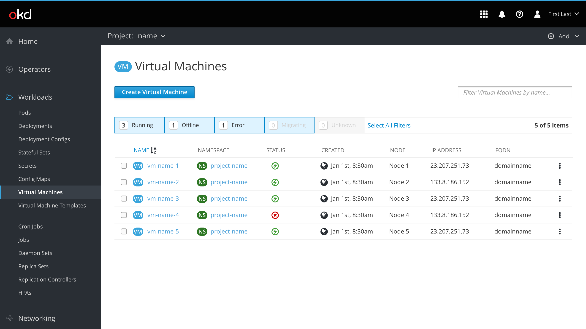
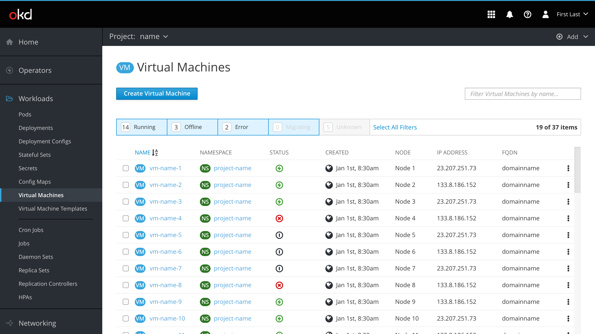
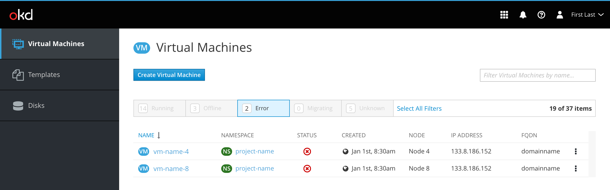
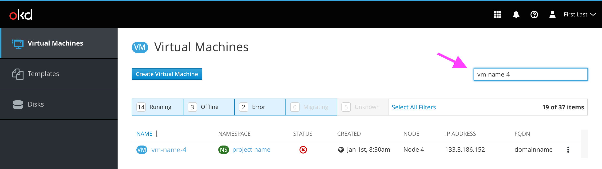
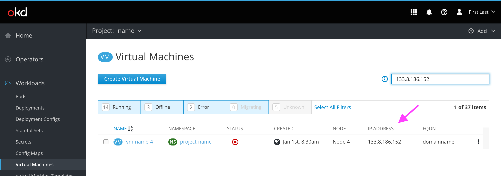
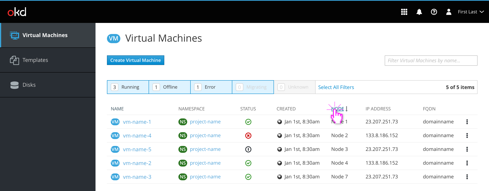
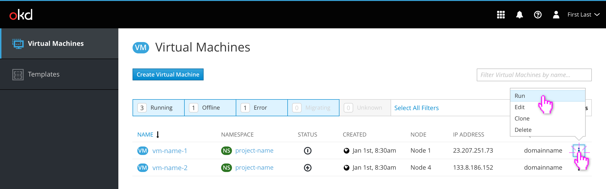
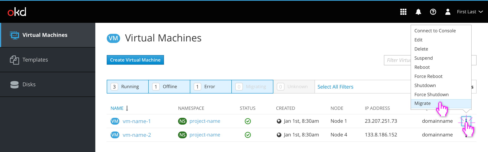

# VM List view

The VM list contains columns for the following:
- Name
- Namespace
- Status
  - running, off, failed, migrating, unknown
- Created
  - Date formatting should follow OpenShift's console, viewable [here](https://github.com/openshift/console/blob/master/frontend/public/components/utils/timestamp.jsx) and [here](https://github.com/openshift/console/blob/master/frontend/public/components/utils/datetime.ts)
  - If possible, the `div`'s title attribute should be set to the exact date/time of creation, including year
- Node
- IP Address
- FQDN

## Long list handling

For now, long lists of items will be displayed in an infinitely-scrollable list.

## Filtering

### Item filters

The predefined filters in the filter bar can be used to narrow the VM list by Status. The user clicks each tab to toggle it off/on.

If possible, `overflow-y: scroll` should be used to prevent the vertical scrollbar from disappearing when the list is shortened (preventing uncomfortable jumping).

### Title filter

The title filter can also be used to further narrow down the VM list. Title filters do not override the filters set in the filtering bar, meaning hidden items will remain hidden even if searched for. This behavior could be a usability issue if users believe the title filter input to be a search input.

### Search filter (bonus)

If possible, the title filter could become a traditional search filter instead, allowing the user to filter results by any text string (or equivalent status) in any column. This could enable users to quickly find a VM by IP address, FQDN, or possibly other fields in the future. Multiple filters could be delineated by a comma in the search query. An information icon describing this advanced functionality would likely be necessary.

## Sorting

VM lists are sorted alphabetically by name by default. Clicking on a different column title will sort that column the same way. Clicking on the same column title twice will reverse the direction. This is all consistent with the OpenShift 4.0 direction.

## States and Actions

When a VM is OFF, the kebab on the right contains options to Run, Edit, or Delete that VM.

When a VM is Running, the kebab menu contains options to Connect to Console (if available), Edit, Delete, Suspend, Reboot, Force Reboot, Shutdown, Force Shutdown, or Migrate the VM.

